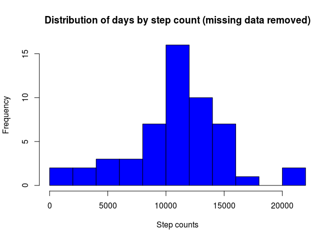
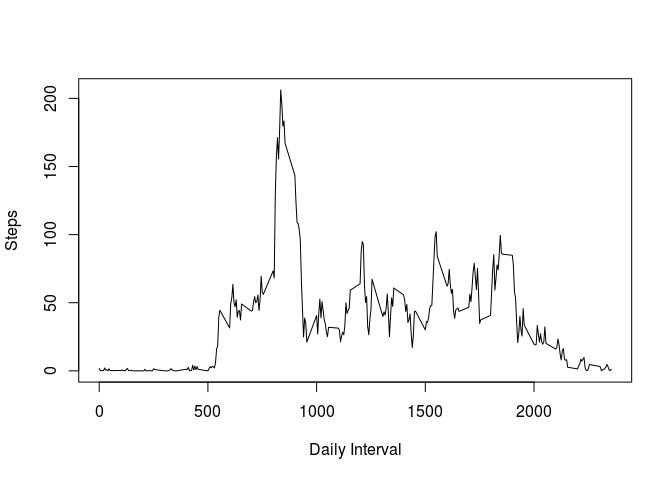
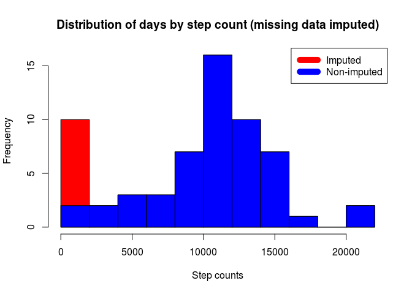
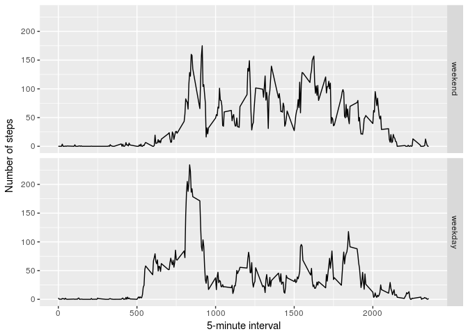

Reproducible Data - Course Project 1
====================================

This report analysis the activity patterns of a subject who has been wearing and activity monitor.

Loading and preprocessing the data
----------------------------------

### Load the required R libraries

``` r
# load all packages used in this exploratory analysis
library(knitr)
library(dplyr)
require(dplyr)
```

### Code for reading in the dataset and/or processing the data

1.  Load the data (read.csv)

2.  Process/transform the data (if necessary) into a format suitable for your analysis

``` r
df_clean <- activity[complete.cases(activity),]
head(df_clean)
```

    ##     steps       date interval
    ## 289     0 2012-10-02        0
    ## 290     0 2012-10-02        5
    ## 291     0 2012-10-02       10
    ## 292     0 2012-10-02       15
    ## 293     0 2012-10-02       20
    ## 294     0 2012-10-02       25

What is mean total number of steps taken per day?
-------------------------------------------------

1.  Calculate the total number of steps taken per day

``` r
df_step_sum <- df_clean %>% group_by(date) %>% summarize(steps=sum(steps))
head(df_step_sum)
```

    ## # A tibble: 6 × 2
    ##         date steps
    ##       <fctr> <int>
    ## 1 2012-10-02   126
    ## 2 2012-10-03 11352
    ## 3 2012-10-04 12116
    ## 4 2012-10-05 13294
    ## 5 2012-10-06 15420
    ## 6 2012-10-07 11015

1.  Make a histogram of the total number of steps taken each day

``` r
hist(x=df_step_sum$steps,
     col="blue",
     breaks=15,
     xlab="Step counts",
     ylab="Frequency",
     main="Distribution of days by step count (missing data removed)")
```



The mean of the steps taken per day is : **10766.19**

The median of the steps taken per day is : **10765**

What is the average daily activity pattern?
-------------------------------------------

1.  This time series plot of the 5-minute interval (x-axis) shows the average number of steps taken, averaged across all days (y-axis).

``` r
steps_per_interval <- aggregate(steps ~ interval,activity, mean)
plot(steps_per_interval$interval, steps_per_interval$steps, type='l', xlab="Daily Interval", ylab="Steps")
```



1.  Which 5-minute interval, on average across all the days in the dataset contains the maximum number of steps?

``` r
interval_max <- which.max(steps_per_interval$steps)
interval_max_steps <- steps_per_interval[interval_max,1]
```

The interval with the largest number of steps is interval **104** which has **835** steps.

Imputing missing values
-----------------------

``` r
missing_value_count <- sum(!complete.cases(activity))
```

1.  The total number of rows with missing data in the data set is **2304**
2.  The strategy for filling missing values is to find the mean for the whole day when a missing value is found and replace the entry with that day's mean. An observation

``` r
mean_steps_per_day <- aggregate(steps ~ date, activity, mean, na.action=na.pass)
mean_steps_per_day[is.na(mean_steps_per_day)[,2],2] <- 0
incomplete_cases <- activity[!complete.cases(activity),]
incomplete_cases_with_mean <- merge(incomplete_cases, mean_steps_per_day, by="date")
names(incomplete_cases_with_mean)[4] <- "steps"
activity_imputed <- cbind(activity) 
```

1.  Create a new dataset that is equal to the original but with the missing data filled in.

``` r
activity_imputed[!complete.cases(activity),] <- incomplete_cases_with_mean[,c("steps","date","interval")]
```

1.  Make a histogram of the total number of steps taken each day and calculate and report the mean and median total number of steps taken per day.

``` r
df_step_sum_imputed <- activity_imputed %>% group_by(date) %>% summarize(steps=sum(steps))
```

``` r
hist(x=df_step_sum_imputed$steps,
     col="red",
     breaks=15,
     xlab="Step counts",
     ylab="Frequency",
     main="Distribution of days by step count (missing data imputed)")
hist(x=df_step_sum$steps,
     col="blue",
     breaks=15,
     xlab="Step counts",
     ylab="Frequency",
     main="Distribution of days by step count (missing data removed)", add=T)
legend("topright", c("Imputed", "Non-imputed"), col=c("red", "blue"), lwd=10)
```



The mean of the steps taken per day is when missing steps are imputed via the daily mean strategy : **9354.23**

The median of the steps taken per day is when nulls are imputed via the daily mean strategy : **10395**

The most notable effect of imputing the missing data with the daily means is to increase the frequency of intervals which have zero as can be seen on the historgram. This is due to the fact that several whole days of data are missing causing their daily means to be zero and all the intervals of those days to be zero as well. This also shifts the mean down by **13.1147541%** and shifts the meadian down by **3.4370646%**

Are there differences in activity patterns between weekdays and weekends?
-------------------------------------------------------------------------

1.  Create a new factor variable in the dataset with two levels – “weekday” and “weekend” indicating whether a given date is a weekday or weekend day.

``` r
# conver date to an r Date so the weekdays function can be used
activity$date <- as.Date(activity$date)
weekends <- c('Saturday', 'Sunday')
# produce a binary vector of the weekends and use it to create a new factor column
activity["week_day"] <- factor((weekdays(activity$date) %in% weekends), levels=c(TRUE, FALSE), labels=c('weekend', 'weekday') )
head(activity)
```

    ##   steps       date interval week_day
    ## 1    NA 2012-10-01        0  weekday
    ## 2    NA 2012-10-01        5  weekday
    ## 3    NA 2012-10-01       10  weekday
    ## 4    NA 2012-10-01       15  weekday
    ## 5    NA 2012-10-01       20  weekday
    ## 6    NA 2012-10-01       25  weekday

1.  Make a panel plot containing a time series plot (i.e. type = "l") of the 5-minute interval (x-axis) and the average number of steps taken, averaged across all weekday days or weekend days (y-axis).

``` r
library(ggplot2)
averages <- aggregate(steps ~ interval + week_day, data = activity, mean)
ggplot(averages, aes(interval, steps)) + geom_line() + facet_grid(week_day ~ .) + 
    xlab("5-minute interval") + ylab("Number of steps")
```


